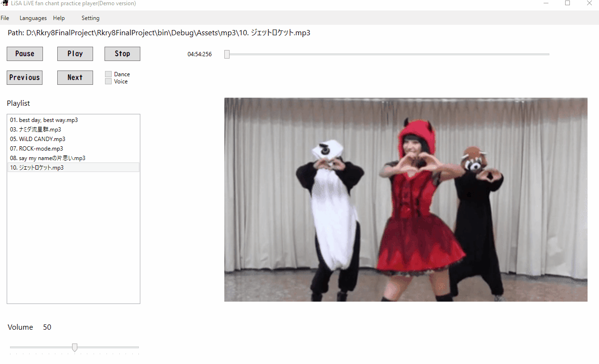
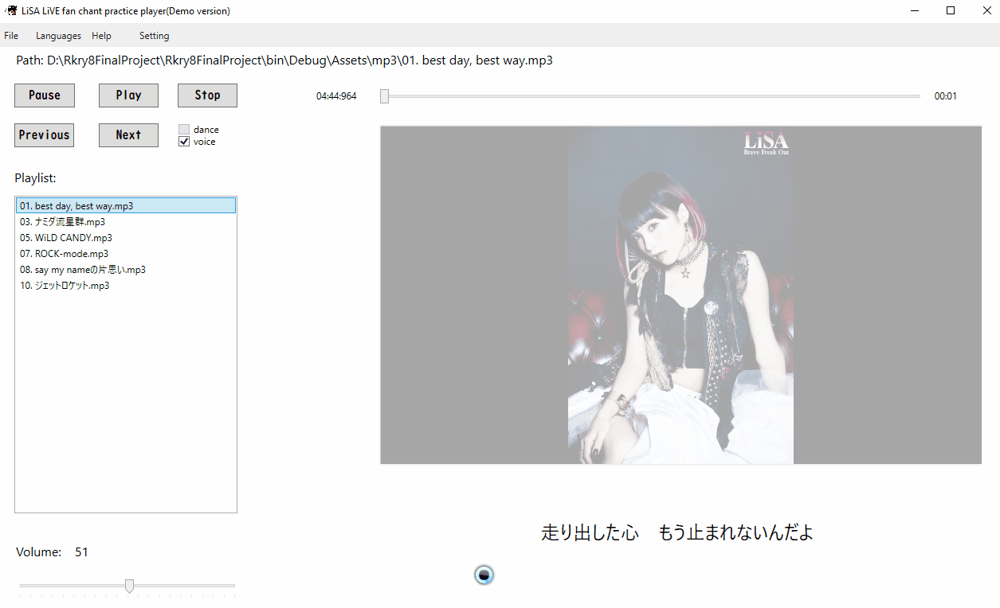

# Karaoke Player for Concerts
It's a player that can play musics with karaoke lyric, dances, and fan chants

# New Features!
  - Supporting multiple languages (English/Chinese/Japanese)
    
  - Dynamic lyrics
  - Settings can be saved
  - Supporting keyboard control
    
  - Load lyric files automatically when mp3 files are opened
  - Volumn adjusting bar and time-seeking bar
  - Dance display (at the moment only "say my nameの片思い" is supported)
  - Switching songs with Next/Previous button

Extra libraries included:
 - Wpfanimatedgif (to play gif files) 
 - WMPLib (to play musics) 
 - TagLib (to get info from the current music)

### Dance Demostration

### Player demostration

